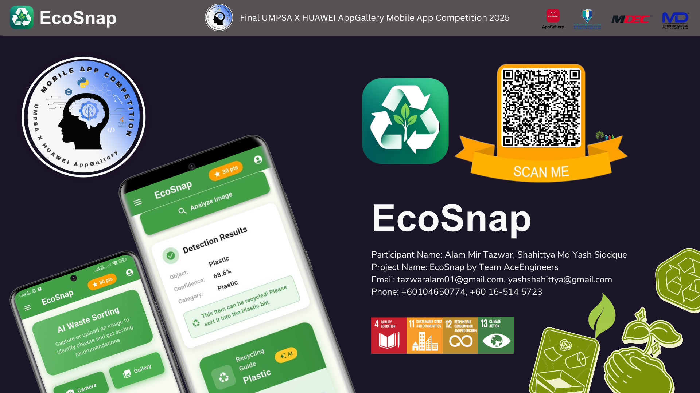
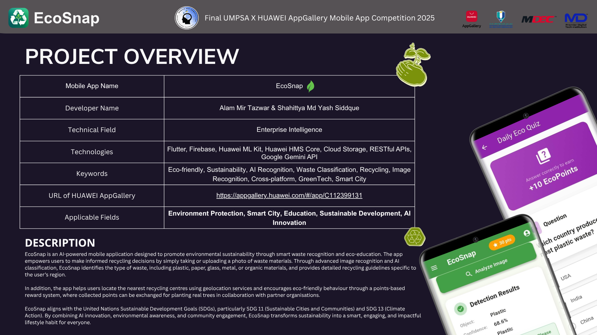
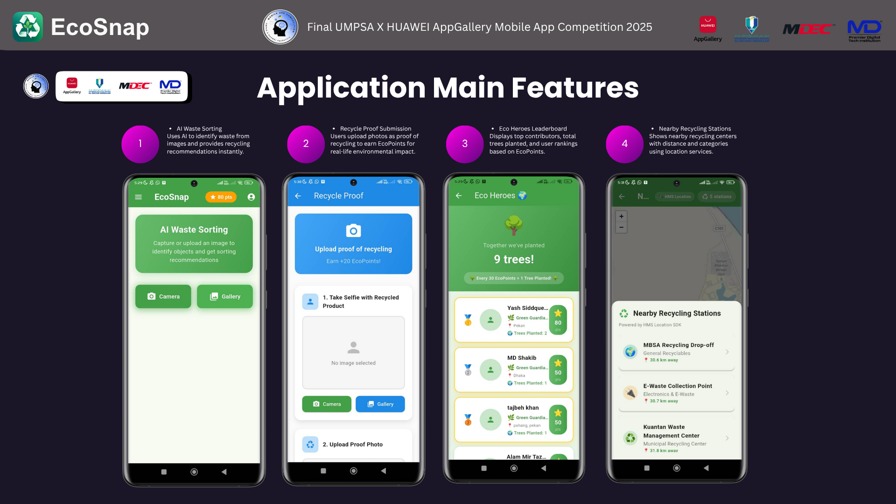
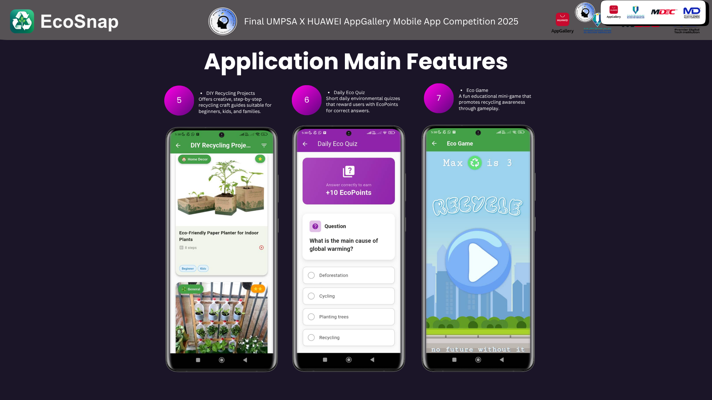
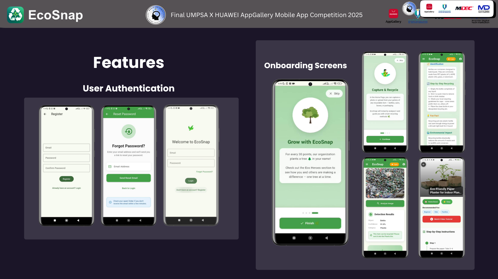
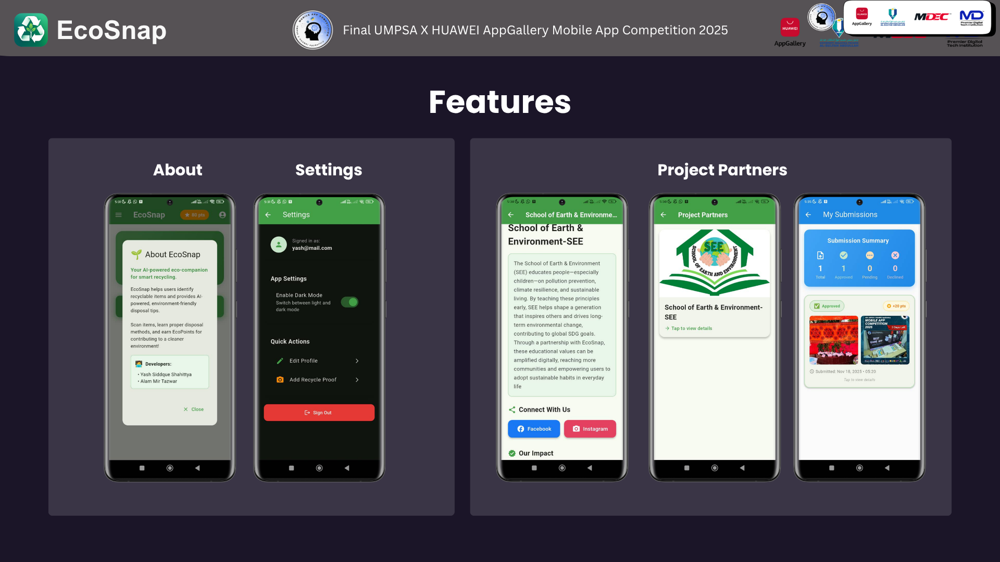
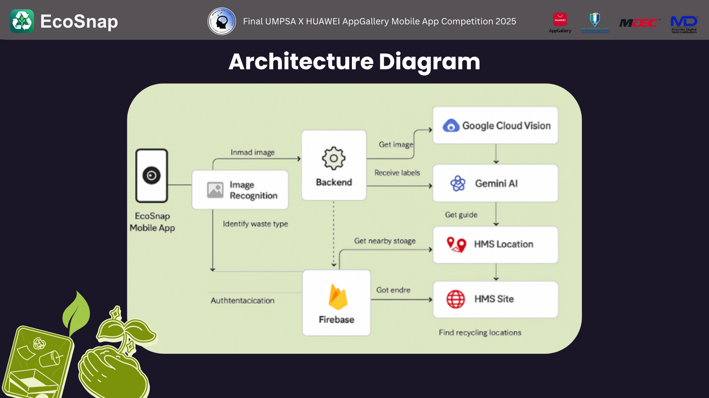
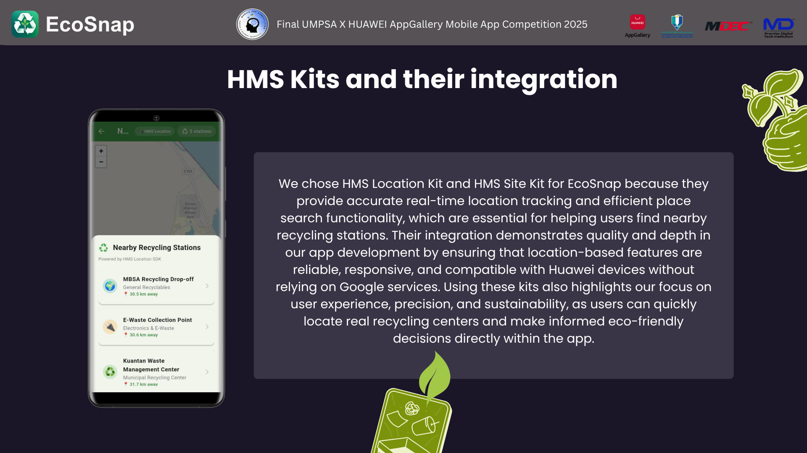
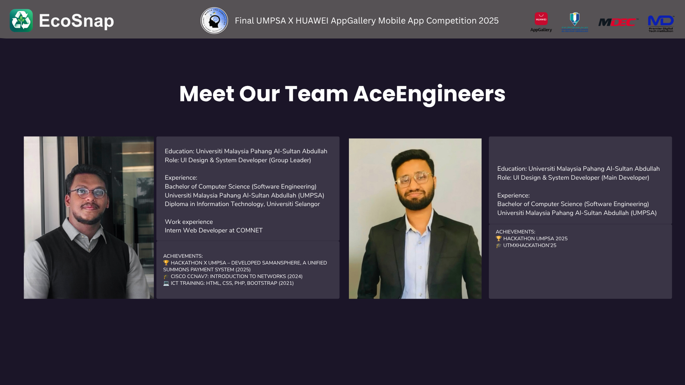

---

# 👤 User Registration Screen

  

## 📌 Overview

The **User Registration Screen** enables new users to create an EcoSnap account before accessing the application's AI-powered waste classification features. This screen provides a simple and secure onboarding experience using email-based authentication.

## ✨ Key Features

- 📧 Email registration
- 🔒 Secure password creation
- ✅ Password confirmation validation
- 🟢 One-tap account registration
- 🔁 Direct navigation back to the Login screen for existing users
- ⬅️ Back button for easy navigation

## ⚙️ Functionalities

- Validates user input before account creation.
- Ensures the password and confirmation password match.
- Prevents incomplete registration by requiring all mandatory fields.
- Creates a new user account using **Firebase Authentication**.
- Redirects users to the application after successful registration.

## 🎨 UI & User Experience

The registration interface follows EcoSnap's clean and minimal design philosophy:

- Soft green accent color representing sustainability.
- Simple form layout for faster user onboarding.
- Large input fields for improved accessibility.
- Clear navigation between Login and Register pages.
- Minimal distractions, allowing users to complete registration quickly.

## 💻 Technologies Used

- Flutter
- Firebase Authentication
- Material Design Widgets
- Form Validation
- TextFormField
- ElevatedButton

## 🎯 Purpose

A secure authentication system ensures that every user has a personalized EcoSnap account. This enables future features such as user profiles, recycling history, AI prediction records, achievements, and personalized sustainability insights.

> **Recruiter Note:**  
> This screen demonstrates the implementation of secure user authentication, form validation, and Firebase integration while maintaining a clean and user-friendly interface.

# 🌱 EcoSnap
### AI-Powered Smart Recycling & Sustainability Mobile Application

🏆 **Best Game App Award Winner**  
**UMPSA × Huawei AppGallery Mobile App Competition 2025**

Developed by **Team AceEngineers**

---

# 📖 Overview

EcoSnap is an AI-powered mobile application that promotes sustainable living through intelligent waste recognition, eco-education, gamification, and community engagement.

Users can instantly identify recyclable waste by capturing or uploading an image, receive recycling guidance, locate nearby recycling centres, complete environmental quizzes, earn EcoPoints, and compete on leaderboards while contributing towards a greener future.

The project was developed for the **UMPSA × Huawei AppGallery Mobile App Competition 2025**, where it received the **Best Game App Award**.

---

# 🏆 Achievement

🥇 **Best Game App Award**

**UMPSA × Huawei AppGallery Mobile App Competition 2025**

---

# 📋 Project Overview

---

# ✨ Key Features

### 🤖 AI Waste Recognition
- Capture or upload waste images
- AI-powered waste classification
- Recycling recommendations
- Smart recycling guide

### 🌍 Nearby Recycling Stations
- HMS Location Kit
- HMS Site Kit
- Find nearby recycling centres
- Distance-based recommendations

### 🎮 Gamification
- EcoPoints reward system
- Eco Heroes leaderboard
- Daily environmental quiz
- Recycling mini game

### 🌱 Sustainability
- DIY recycling projects
- Eco education
- Green lifestyle tips
- SDG awareness

### 👤 User Management
- Authentication
- User profile
- Settings
- Submission management

---

# 📱 Application Screens

## Main Features

---

## Additional Features

---

## Authentication & Onboarding

---

## More Application Features

---

# 🏗️ System Architecture

EcoSnap integrates multiple cloud and AI technologies to deliver intelligent waste recognition and sustainability services.

Architecture components include:

- Flutter Mobile Application
- Firebase Authentication
- Firebase Cloud Storage
- Google Cloud Vision API
- Google Gemini AI
- Huawei HMS Location Kit
- Huawei HMS Site Kit
- Backend Services

---

# 📍 Huawei Mobile Services (HMS)

Huawei Mobile Services were integrated to provide:

- HMS Location Kit
- HMS Site Kit
- Nearby Recycling Stations
- Real-time Location Services
- Huawei Device Compatibility

---

# 🛠️ Technology Stack

### Mobile Development
- Flutter
- Dart

### Backend & Cloud
- Firebase Authentication
- Firebase Cloud Storage
- Firebase Firestore

### Artificial Intelligence
- Google Cloud Vision API
- Google Gemini AI

### Huawei Mobile Services
- HMS Core
- HMS Location Kit
- HMS Site Kit

### Other Technologies
- REST APIs
- Geolocation Services
- Image Recognition
- Cloud Integration

---

# 🌍 Sustainable Development Goals (SDGs)

EcoSnap supports:

- 📚 SDG 4 — Quality Education
- 🏙️ SDG 11 — Sustainable Cities & Communities
- ♻️ SDG 12 — Responsible Consumption & Production
- 🌱 SDG 13 — Climate Action

---

# 👨‍💻 Team AceEngineers

### Developers

- **Alam Mir Tazwar**
- **Shahittya Md Yash Siddique**

---

# 📄 Repository

This repository showcases the project developed during the Huawei AppGallery Mobile App Competition.

The source code is not publicly available as it was developed for academic and competition purposes.

---

# ⭐ Support

If you found this project interesting, please consider giving it a ⭐ on GitHub.
